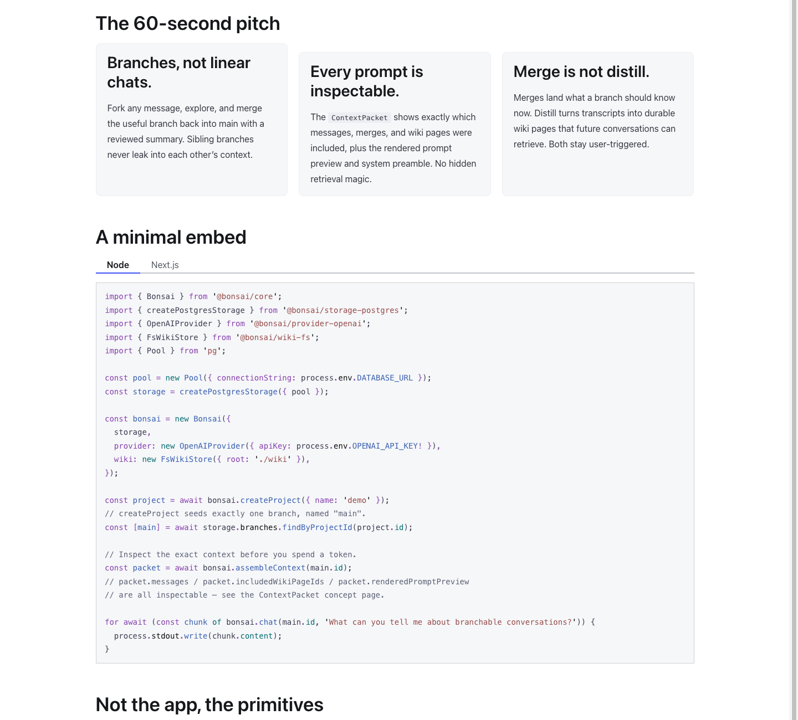

# bonsai-core

**Bonsai is a toolkit for building chat apps where conversations with an AI don't have to stay a single, linear thread.**

## What Bonsai is for

Most AI chat apps force every conversation down one straight line: you ask, it answers, you ask again, and the whole history piles up in order. If you want to explore a tangent — "what if we tried a different approach?" — you either derail the conversation or start over from scratch and lose the context you'd already built up.

Bonsai lets a conversation branch, the way a doc or a codebase can. From any point in a chat, you can fork off a new branch to explore an idea, without disturbing the original thread. If the branch turns out useful, you can merge a summary of it back into the main conversation. If it's a dead end, you just abandon it — nothing about it leaks back in. And when a conversation (or a branch) produces something worth keeping long-term, you can distill it into a wiki page that future conversations can draw on, instead of re-explaining it every time.

Crucially, Bonsai never does any of this automatically behind your back. Branching, merging, and distilling are all actions your app's user explicitly takes — and at every step, Bonsai can show you exactly what information was assembled and sent to the model for a given reply, so "why did the AI say that?" always has a concrete answer.

## Who this is for

Bonsai is **not** a finished chat app you install and open in a browser — it's a library that developers embed *into* their own product. If you're building a chat-based app (a support tool, a research assistant, an internal copilot) and want branching, mergeable context, and durable memory as building blocks, Bonsai gives you the underlying pieces — the tree/branch/merge/distill logic, plus swappable adapters for where you store data, which LLM you call, and how you search past knowledge — so you don't have to build that plumbing yourself.

## How it works, in short

- **Tree Model** — every project starts as one `main` branch; forking a branch at any message creates a new branch that can be explored independently.
- **ContextPacket** — before (or instead of) sending a prompt to the model, you can inspect the exact packet of messages, merges, and wiki pages that would be included — no hidden retrieval step.
- **Merge** — land a reviewed summary of a branch back onto its parent branch, as an explicit, user-approved action.
- **Distill** — turn a branch or merge's transcript into a durable Markdown wiki page that later conversations can retrieve.
- **Wiki** — the durable, human-readable knowledge base distill writes into: plain Markdown files with frontmatter, easy to read, grep, or back up outside of Bonsai entirely.
- **Retrieval** — a pluggable interface for searching that wiki (full-text search out of the box; embeddings-based search can be swapped in later).

Read the [Concepts](./docs/src/content/docs/concepts) pages or the [docs site](./docs) for the full explanation of each, or the [Quickstart](./docs/src/content/docs/quickstart.mdx) for a working example.

## See it in action

The docs site landing page (`pnpm docs:dev`) walks through the same pitch above, plus a minimal working embed:



## Status

Phase 1 scaffold. No package is published yet.

## Layout

```
packages/
  core/              # @bonsai/core — framework-agnostic domain (Storage/LLMProvider/WikiStore/Retriever interfaces)
  storage-postgres/  # @bonsai/storage-postgres — Postgres migrations + repositories + FTS retriever
  provider-openai/   # @bonsai/provider-openai — OpenAI-compatible chat/streaming provider
  wiki-fs/           # @bonsai/wiki-fs — Markdown-on-disk WikiStore
  server/            # @bonsai/server — thin optional HTTP layer
examples/            # example embedders (added in later phases)
```

## Prerequisites

- Node `>=20.11.0`
- pnpm `9.15.4` (pinned via `packageManager`)

## Commands

```
pnpm install              # install workspace dependencies
pnpm typecheck            # tsc -b across all packages via project references
pnpm build                # build all packages that define a build script
pnpm test                 # run tests across the workspace
pnpm lint                 # ESLint (incl. `no-restricted-imports` boundary rules on packages/core)
pnpm depcruise            # dependency-cruiser — forbid core -> adapter imports
pnpm boundary:verify      # positive test: fixture must be rejected by lint + depcruise
pnpm publint              # publint --strict per package (release gate)
pnpm attw                 # arethetypeswrong per package (release gate, ESM-only profile)
pnpm release:gate         # build + publint + attw (run before publishing)
pnpm changeset            # add a changeset entry for a release
pnpm changeset:status     # show pending changesets
pnpm docs:dev             # run the docs site locally (Astro Starlight)
pnpm docs:build           # build the static docs site under docs/dist
pnpm docs:preview         # preview a built docs site
```

## Docs site

Public documentation lives under [`docs/`](./docs) as its own pnpm workspace package (`@bonsai/docs`, private), built with Astro Starlight. The API Reference is auto-generated from each package's `src/index.ts` via TypeDoc + `starlight-typedoc`. Landing page, quickstart, concept pages, and recipes are verified against the current `@bonsai/*` API surface.

## Boundary enforcement

`@bonsai/core` is framework- and adapter-agnostic by contract. Two layers defend that boundary:

- **ESLint `no-restricted-imports`** (scoped to `packages/core/**`) bans `react`, `react-dom`, `next/*`, `tailwindcss`, `pg`/`postgres`/`sqlite*`, `fs`/`node:fs`, `net`, node http clients, and provider SDKs.
- **dependency-cruiser** forbids `packages/core → packages/{storage-*, provider-*, wiki-fs, server}` (both by resolved path and by `@bonsai/*` module name).

`pnpm boundary:verify` runs both tools against intentional violation fixtures under `packages/core/src/__fixtures__/` and fails if either tool accepts them. CI runs it on every push/PR.

## References

- Extraction plan and boundary map: [EXTRACTION_PLAN.md](./EXTRACTION_PLAN.md)

## License

[MIT](./LICENSE)
